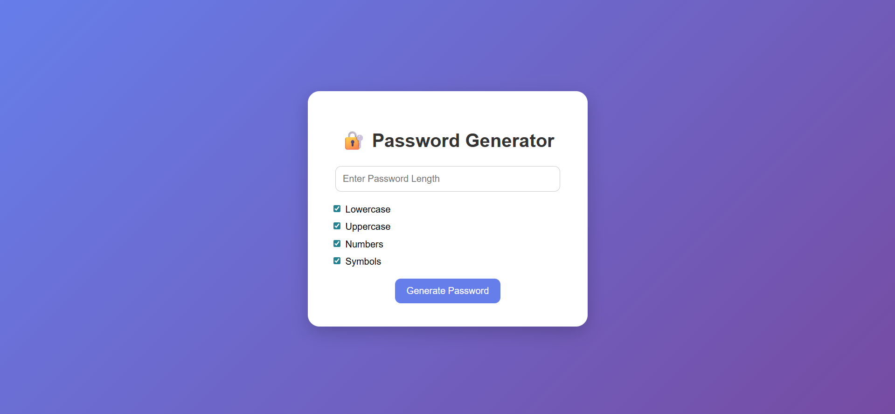
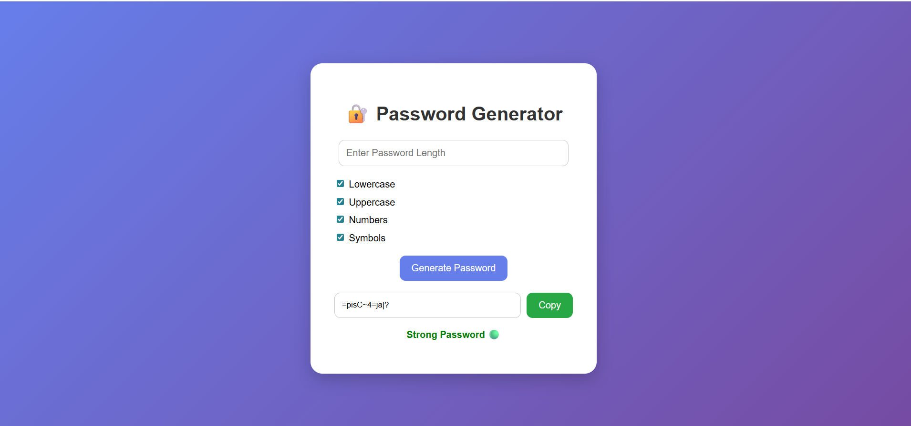

# 🔐 Password Generator

A modern and interactive Password Generator web application built using Python Flask, HTML, CSS, and JavaScript.

This project generates secure random passwords based on user-selected options such as lowercase letters, uppercase letters, numbers, and symbols. It also includes password strength checking and copy-to-clipboard functionality.

---

## 🚀 Features

- Generate secure random passwords
- Select password character types:
  - Lowercase letters
  - Uppercase letters
  - Numbers
  - Symbols
- Password strength checker
- Copy password with one click
- Responsive modern UI
- Error handling for empty selections
- Secure password generation using Python `secrets` module

---

## 🛠️ Technologies Used

- Python
- Flask
- HTML5
- CSS3
- JavaScript

---

## 📂 Project Structure

```bash
password-generator/
│
├── app.py
├── requirements.txt
├── Procfile
├── README.md
│
├── templates/
│   └── index.html
│
├── static/
│   └── style.css
│
└── screenshots/
    ├── main-page.png
    └── generated-password.png
```

---

## ▶️ How to Run the Project

### 1️⃣ Clone the Repository

```bash
git clone https://github.com/swathi863/password-generator.git
```

---

### 2️⃣ Navigate to Project Folder

```bash
cd password-generator
```

---

### 3️⃣ Install Dependencies

```bash
pip install -r requirements.txt
```

---

### 4️⃣ Run Flask Application

```bash
python app.py
```

---

### 5️⃣ Open Browser

```bash
http://127.0.0.1:5000
```

---

## 🌐 Live Demo

https://password-generator-v9y4.onrender.com

---

## 📸 Screenshots

### 🔹 Home Page



---

### 🔹 Generated Password Output



---

## 🔐 Password Options

Users can generate passwords using:
- Lowercase letters
- Uppercase letters
- Numbers
- Symbols

Example Passwords:

```txt
aB@92xK#
```

```txt
48392@Aa
```

```txt
Qw#7Lm!2
```

---

## 📌 Future Improvements

- Password history
- Password entropy checker
- Download password as TXT
- Advanced UI animations
- Multi-theme support
- Custom password presets

---

## 👨‍💻 Author

Developed by  Desa Swathi

---

## 🔗 GitHub Repository

https://github.com/swathi863/password-generator